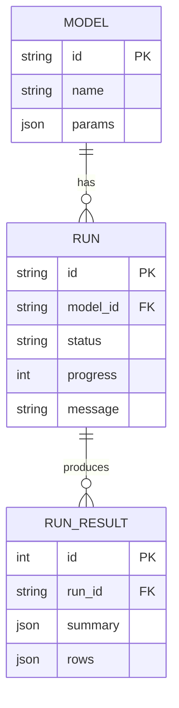

# ERD (Minimal)

```mermaid
erDiagram
  MODEL ||--o{ RUN : has
  RUN ||--o{ RUN_RESULT : produces

  MODEL {
    string id PK
    string name
    json params
  }
  RUN {
    string id PK
    string model_id FK
    string status
    int progress
    string message
  }
  RUN_RESULT {
    int id PK
    string run_id FK
    json summary
    json rows
  }
```